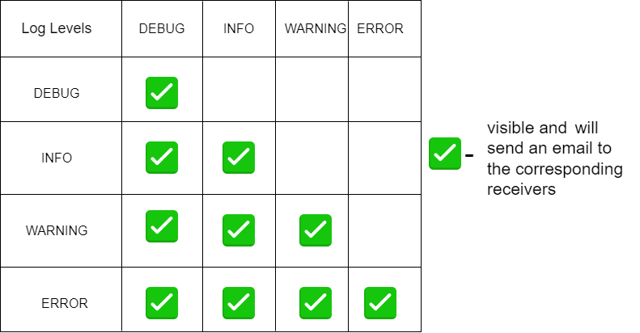

# Custom Logging System

<p align="center">
  
</p>

Custom Logging System that allows logging messages with different log levels. This will enable developers to control the amount of information logged at runtime, making it easier to focus on relevant details for debugging or troubleshooting. It supports adding multiple log targets, including *a console log target* and *an email log target* for sending log messages via email.

To enhance the efficiency of the log handling and focus on critical information, the minimum accepted log level can be set to, for example, `Warning`. This configuration means that any logs with lower levels (`Debug` or `Info` in this case) will not be processed or handled by the system. Only logs with a `Warning` and `Error` level will be accepted and given appropriate attention.

This decision helps to prioritize the most important and potentially critical log events, ensuring that the attention is directed toward significant issues and reducing noise from less important log entries.

## How to use
**Steps**
1. Clone this repository:
```
git clone <repo - url>
```
2. Turn on 2-step verification in your sender account settings, and generate a password for the Python application (in the "Select app" window choose "Other" and enter Python as the app name). Replace the sender password with the generated one found in the `config.json` file.  
3. cd to the logger folder and replace receivers and sender info in the config.json file.
4. To use the system, import logger in your .py file: 
```
from logger import *   
logger = Logger(min_log_level=LogLevel.INFO)
```

## Improvement ideas
* Use a database to store logs. 
* Add queue to multiprocess threading structure
